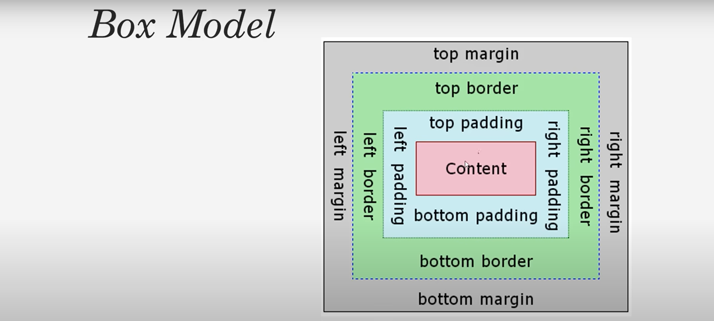
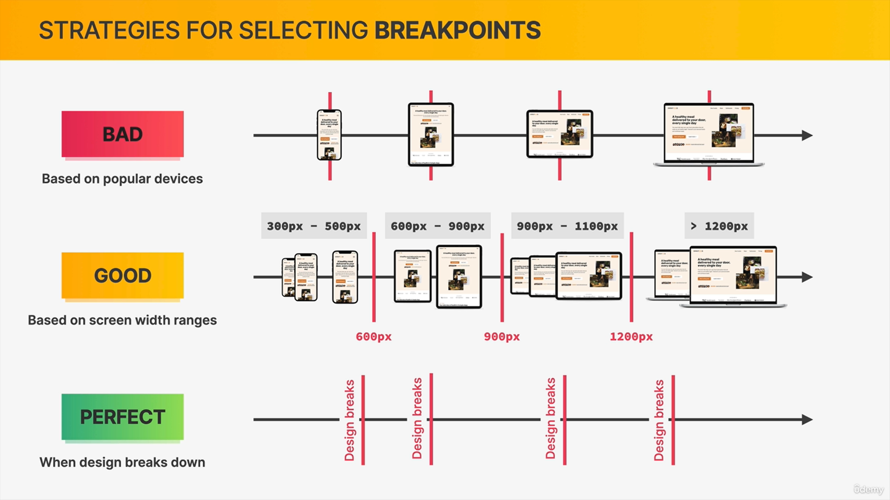

# Html

### forms in html
```html
 <form>
<label>first name</label>
<input type=”text” name=”first Name” placeholder=”enter your name”>
<label> gender</label>
<select  name=”gender”>
<option value=”male”>male</option>
<option value=”female”>female</option>
</select>

</form>
 ```
### image in html
```html
 
``` 
### link
```html
<a href=”address”> </a>
```

```html
<abbr title=”world wide web”> www</abbr>
```
**abbr will have curly line under it and if we hover it will show title.**
### Html5 tags
```html
<header></header>
<nav></nav>
<section></section>
<article></article>
<aside></aside>
<footer></footer>
```
# css
### link to css in html(in head)
```html
<link rel="stylesheet" type="text/css" href="css/style.css"/>
```
### Pseudo-classes 
```css
li:first-child{}
li:last-child{}

```
**we can also target a specific child .**
```css
li:nth-child(2)
```
***we can write even or odd too.***
## styling hyper links using pseudo classes.
```css
a:link{}
```
**this will target which have ***href*** attribute**
```css
a:active{}
```
**when you clicked you wanna give style to it.**
### when they are multiple decorations from the same element which selector has the highest priority?
**ID selector** has the highest priority,if there are multiple **ID selectors** the last one gets applied.
**in case there is no ID selector priority is classes or pseudo-class-selectors** 
### boxModel in css

# responsive
### how media queries work (with max-width )
we want to apply a certain style for the range between **0 and 600 pixles**we would write a media queris like this 
```css
@media (max-width:600px)
```
this will check if the current viewport width a smaller or equal than 600 pixles then all the css code that is in this media query will apply.
**At 700px it will not work**
### selecting breakpoints.
### what are breakpoints?
breakpoints are the viewport with at which we want or designed to change, breakpoints are the pixel values,that we want to put in all media queries.

## flexbox in css
**The flexible box layout module (usually referred to as flexbox) is a one-dimensional layout model for distributing space between items and includes numerous alignment capabilities.**
### the two axes of flexbox
When working with flexbox you need to think in terms of two axes — the main axis and the cross axis. The main axis is defined by the flex-direction property, and the cross axis runs perpendicular to it. Everything we do with flexbox refers back to these axes, so it is worth understanding how they work from the outset.
### center all the elements verticaly
```css
align-items:center;
```
### center elements horizantly
center inside the flex container 
```css
justify-content:center;
```
### flex container
**to create space between items without using margin.**
```css
gap:0;
```
**to align items along main axis (horizantly).**
```css
justify-content:flex-start|flex-end|center|space-between|space-around;
```
**to align items along cross axis (verticaly).**
```css
align-items:flex-start|flex-end|center|baseline;

```
### the element on which we wanna use flexbox is called the **flex container**
# css grid
### css Grid is a set of **css properties** for **building 2-dimensional layouts**
### the main idea behind **css Grid** is that we divide a container element into rows and columns that can be filled with its child elements.
### css Grid is not meant to replace flexbox! instead,they work perfectly together.Need a 1D layout ? use flexbox. Need a 2D layout? use css Grid.


 


